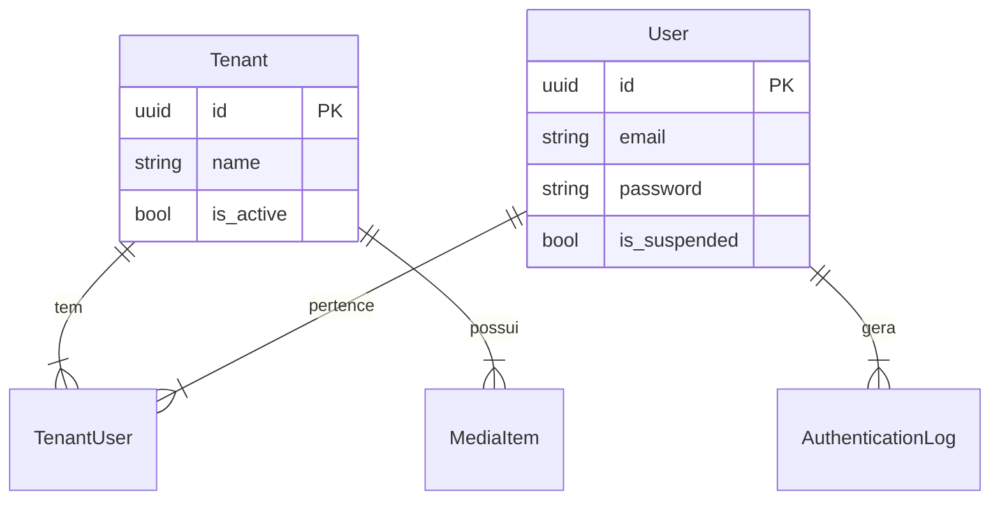

# Arquitetura do Sistema

## 🏛️ Padrões Adotados

### Models & Database
- **Primary Keys**: UUIDs universais (via `App\Traits\UuidTrait`).
- **Tenancy**: Model `Tenant` central.
  - Relação N:N com `User` via tabela `tenant_user`.
  - Escopo global de tenant aplicado em models filhos.
- **Audit**: Tabela `authentication_log` rastreia todos os acessos.

### Camada de Serviço
Lógica de negócio complexa é extraída para Services, não Controllers.
- **Exemplo**: `App\Services\MediaService` manipula uploads, não o Controller.

### Frontend / Admin
- **Filament 4**: Painel administrativo principal.
- **Temas**: CSS modular em `resources/css/filament/admin/`.
  - Separação clara: `light.css`, `dark.css`, `mapping.css`.

## 🧩 Diagrama de Entidades Core

## 🔐 Segurança
- **Policies**: Cada Model tem uma Policy correspondente em `app/Policies`.
- **RBAC**: Permissões granulares (`users.view`, `tenants.update`) via Spatie.
- **MFA**: Suporte a códigos de recuperação e segredo de app.

---
*Baseado na análise estática dos Models User e Tenant.*
