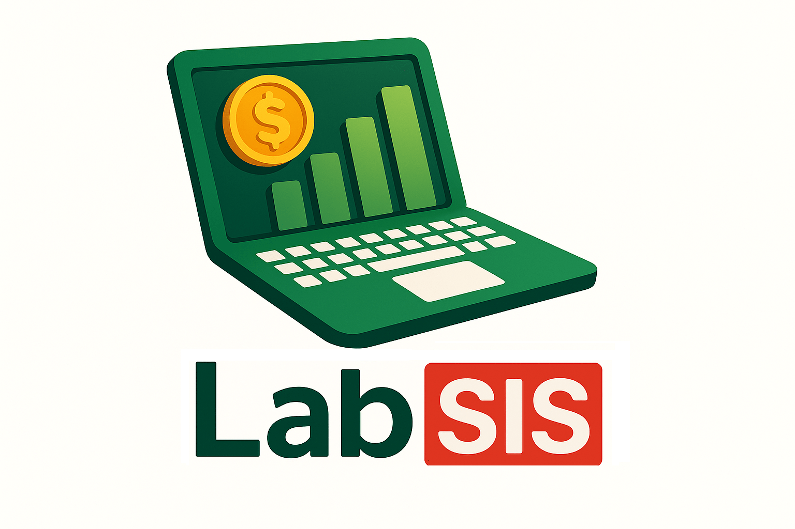

# LabSIS SaaS KIT V4

<div align="center">
  
  <br>
  <a href="https://www.labsis.dev.br">www.labsis.dev.br</a><br>
  <em>Transformando desafios reais em soluções inteligentes</em>
</div>

<br>
<p align="center">
    <a href="https://filamentphp.com"></a>
    <a href="https://laravel.com"></a>
    <a href="https://livewire.laravel.com"></a>
    <a href="https://php.net"></a>
</p>

## Sobre o labSIS SaaS KIT

Este repositório é um Kit de Iniciação (Starter Kit) para o desenvolvimento de aplicações SaaS (Software as a Service) utilizando a stack TALL (Tailwind, Alpine.js, Laravel, Livewire) e Filament.

O objetivo deste projeto é fornecer uma base sólida e rica em recursos para acelerar o desenvolvimento de novas aplicações, seguindo as melhores práticas e convenções do ecossistema Laravel.

## Documentação do Kit

Toda a documentação sobre como utilizar os recursos, padrões e arquitetura deste kit está disponível na pasta [`/docs`](/docs). Recomendamos a leitura para todos os desenvolvedores que irão atuar neste projeto.

- [**Autenticação de Dois Fatores (2FA) no Filament**](/docs/autenticacao-2fa.md)
- [**Cores no Filament**](/docs/cores-filament.md)
- [**Customização da Aparência do Painel**](/docs/customizando-layout.md)
- [**Edição de Perfil no Filament**](/docs/edicao-perfil.md)
- [**Entendendo o AppServiceProvider**](/docs/app-service-provider.md)
- [**Otimização com #[Computed]**](/docs/livewire-computed.md)
- [**Login Unificado**](/docs/login-unificado.md)
- [**Notificações**](/docs/notifications-trait.md)
- [**Roles/Permissions**](/docs/roles-e-permissoes.md)
- [**Suspensão de Usuários**](/docs/suspensao-usuarios.md)
- [**Utilizando Enumerações (Enums) com Filament**](/docs/enums.md)
- [**Widgets no Filament**](/docs/widgets-filament.md)

## Pré-requisitos

Antes de começar, certifique-se de ter instalado em sua máquina:

- **Docker** - [Download](https://docs.docker.com/engine/install/)
  - O Docker é essencial para este projeto pois possibilita criar um ambiente de desenvolvimento mais próximo do ambiente de produção, garantindo consistência entre diferentes máquinas e facilitando a implantação.
- **Git** - [Download](https://git-scm.com/)
- **Composer** - [Download](https://getcomposer.org/)
- **Node.js** (versão 18 ou superior) - [Download](https://nodejs.org/)

## Como realizar a instalação

Siga os passos abaixo para configurar o ambiente de desenvolvimento localmente.

**1. Clonar o Repositório**

Primeiro, clone este repositório para a sua máquina local utilizando Git:

```bash
git clone git@github.com:iurygdeoliveira/labSIS-SaaS-KIT-V4.git
cd labSIS-SaaS-KIT-V4
```

**2. Instalar Dependências (PHP e JS)**

Execute os comandos abaixo para instalar as dependências do Composer (backend) e do NPM (frontend).

```bash
composer install
npm install
```

**3. Configurar o Ambiente**

Copie o arquivo de exemplo `.env.example` para criar seu próprio arquivo de configuração `.env`. Em seguida, gere a chave da aplicação, que é essencial para a segurança da sua instância Laravel.

```bash
cp .env.example .env
```

**4. Configurar o Banco de Dados**

Este projeto está configurado para utilizar PostgreSQL com Laravel Sail. Execute as migrations para criar as tabelas no banco de dados. Para popular o banco com dados de exemplo, execute as seeders.

```bash
./vendor/bin/sail up -d
./vendor/bin/sail artisan migrate --seed
```

**5. Compilar os Assets**

Compile os arquivos de frontend (CSS e JavaScript) utilizando o Vite.

```bash
./vendor/bin/sail npm run build
```

A aplicação estará disponível em `http://localhost`. 

## Agradecimentos

Gostaríamos de expressar nossa sincera gratidão a todas as pessoas e equipes cujo trabalho tornou este projeto possível. Suas contribuições para a comunidade de código aberto são uma fonte constante de inspiração e um pilar fundamental para o nosso desenvolvimento.

Em especial, agradecemos a:

-   **Equipe Laravel**: Pela criação e manutenção de um framework robusto, elegante e inovador, disponível em [laravel/laravel](https://github.com/laravel/laravel).
-   **Equipe Filament**: Pelo incrível trabalho no [Filament](https://github.com/filamentphp/filament), que nos permite construir painéis administrativos complexos com uma velocidade e simplicidade impressionantes.
-   **Comunidade Beer and Code** ([beerandcode.com.br](https://beerandcode.com.br/)): Pela excelente metodologia de ensino em Laravel, que tem colaborador com a formação de desenvolvedores PHP, fornecendo conhecimento prático e focado em soluções reais.
-   **Leandro Costa** ([@leandrocfe](https://github.com/leandrocfe)): Por suas valiosas contribuições e por compartilhar conhecimento de alta qualidade sobre Filament em seu canal [Filament Brasil no YouTube](https://www.youtube.com/@filamentbr), que foi fundamental para a implementação de diversas features neste projeto.
-   **Nanderson Castro** ([@NandoKstroNet](https://github.com/NandoKstroNet)): Pelo excelente trabalho no canal [Code Experts](https://www.youtube.com/@codeexperts), que tem sido uma fonte valiosa de conhecimento técnico e boas práticas de desenvolvimento.
-   **João Paulo Leite Nascimento** ([@joaopaulolndev](https://github.com/joaopaulolndev)): Pelo desenvolvimento do pacote [filament-edit-profile](https://github.com/joaopaulolndev/filament-edit-profile), que revolucionou a experiência de edição de perfil de usuários no Filament. Este pacote oferece uma solução completa e elegante para gerenciamento de perfis de usuário.
-   **Wallace Martins** ([@wallacemartinss](https://github.com/wallacemartinss)): Pela disponibilização do [website_template](https://github.com/wallacemartinss/website_template), que forneceu uma base excelente e moderna para a construção do portal público deste projeto.
-   **Jeferson Gonçalves** ([@jeffersongoncalves](https://github.com/jeffersongoncalves)): Pelo desenvolvimento do pacote [filament-cep-field](https://github.com/jeffersongoncalves/filament-cep-field), que agregou grande valor ao projeto ao fornecer um campo de formulário que busca e preenche automaticamente dados de endereço a partir de um CEP, otimizando a experiência do usuário.

O trabalho de vocês contribui significativamente para o avanço e a qualidade deste projeto.

## ⚠️ Recursos em Desenvolvimento

**Gestão de Mídias:**
- **CRUD completo para mídias:** Sistema de gerenciamento para diferentes tipos de arquivos (áudio, vídeo, documento e imagem).
- **Preview de Conteúdo:** Visualização direta de mídias com suporte a múltiplos formatos e fallbacks para conteúdo não carregável.
- **Organização por Tipo:** Categorização automática baseada no MIME type com badges coloridos para identificação visual.
- **Tamanho Humanizado:** Exibição do tamanho de arquivo em formato legível (KB, MB, GB).

## 🚀 Recursos Atuais

O Kit oferece uma base sólida com os seguintes recursos já implementados:

- **Gestão de Usuários:**
  - **CRUD completo para usuários (Criação, Leitura, Atualização e Exclusão).**
  - **Sistema de Suspensão de Usuários:** Controle completo de acesso com toggle de suspensão, registro de motivo e timestamp automático. Usuários suspensos são automaticamente bloqueados do acesso aos paineis.
  - **Organização em Abas:** Visualização detalhada organizada em abas (Informações Pessoais, Datas, Suspensão).

- **Edição de Perfil:**
    - **Avatar:** Upload e gerenciamento de foto de perfil com suporte a PNG, JPG e JPEG (máximo 1MB).
    - **Configurações Personalizáveis:** Interface intuitiva para edição de informações pessoais, email e senha.
    - **Autenticação de Dois Fatores (2FA):** Sistema de 2FA integrado ao perfil do usuário, compatível com aplicativos de autenticação (Google Authenticator, Authy, etc.).

- **Login Unificado:**
  - **Login com Email e Senha:** Acesso ao painel administrativo com autenticação padrão.
- **Exibição de Widgets:** Widgets personalizados para exibição de métricas e informações relevantes.

- **Website / Landing Page**
  - **Página Inicial Completa:** Uma landing page moderna e responsiva construída com componentes Blade e TailwindCSS.
  - **Seções Pré-definidas:**
  - **Hero:** Seção principal de boas-vindas.
  - **Benefícios:** Lista de vantagens da plataforma.
  - **Como Funciona:** Guia visual do processo.
  - **Depoimentos:** Seção de prova social com scroll automático.
  - **Tabela de Preços:** Componente interativo com seleção de ciclo de pagamento (mensal/anual).
  - **FAQ:** Acordeão de perguntas e respostas.
  - **Navegação Integrada:** Header e footer padronizados com links de navegação e acesso direto à plataforma (`/admin`).

## 🛠️ Recomendação de Ferramentas de Desenvolvimento

Este projeto utiliza um conjunto de ferramentas para garantir a qualidade, padronização e agilidade no desenvolvimento. Abaixo estão os pacotes incluídos no ambiente de desenvolvimento (`require-dev`):

-   **[barryvdh/laravel-debugbar](https://github.com/barryvdh/laravel-debugbar):** Adiciona uma barra de depuração com informações úteis sobre a aplicação.
-   **[egyjs/dbml-to-laravel](https://github.com/egyjs/dbml-to-laravel):** Ferramenta para gerar migrações do Laravel a partir de um esquema DBML.
-   **[fakerphp/faker](https://github.com/fakerphp/faker):** Gera dados falsos para popular o banco de dados em testes e seeders.
-   **[larastan/larastan](https://github.com/larastan/larastan):** Realiza análise estática de código para encontrar bugs sem executar o código.
-   **[laravel/boost](https://packagist.org/packages/laravel/boost):** Otimiza o desempenho de Agentes de IA para o desenvolvimento do sistema em ambiente de desenvolvimento.
-   **[laravel/pint](https://github.com/laravel/pint):** Formata o código PHP para seguir um padrão de estilo consistente (PSR-12).
-   **[laravel/sail](https://github.com/laravel/sail):** Ambiente de desenvolvimento local completo baseado em Docker.
-   **[laravel/tinker](https://github.com/laravel/tinker):** Console interativo (REPL) para executar código no contexto da aplicação.
-   **[leonardolima/laravel-security-check](https://github.com/leonardolima/laravel-security-check):** Verifica dependências do Composer em busca de vulnerabilidades de segurança.
-   **[lucascudo/laravel-pt-br-localization](https://github.com/lucascudo/laravel-pt-br-localization):** Fornece traduções e configurações para a localização em português do Brasil.
-   **[pestphp/pest](https://github.com/pestphp/pest):** Framework de testes elegante e focado no desenvolvedor para PHP.
 
## 📄 Licença

Este projeto está licenciado sob a [MIT License](LICENSE).

## 👥 Autor

- **Iury Oliveira** - [@iurygdeoliveira](https://github.com/iurygdeoliveira)

---

<div align="center">
  <strong>LabSIS - Transformando desafios reais em soluções inteligentes</strong>
</div>