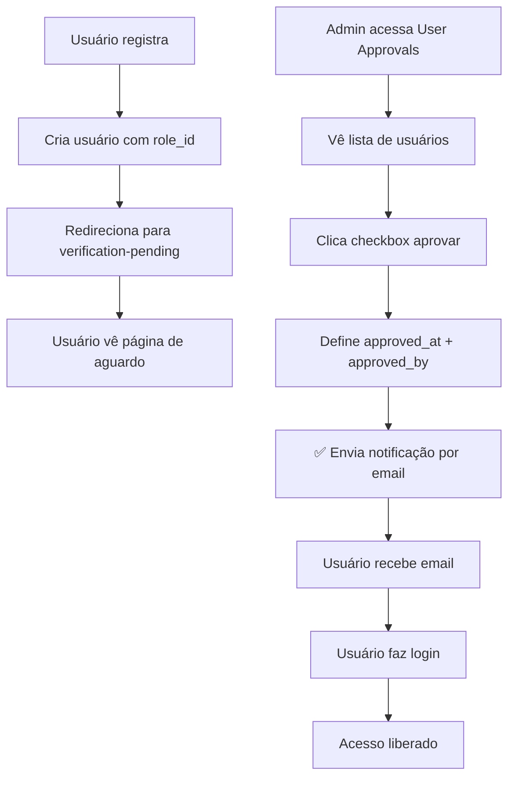

# Análise Comparativa: Processo de Aprovação de Usuários

## LabSIS-KIT vs Admin-Approved-Registration-Process

### Visão Geral

Este documento apresenta uma análise comparativa entre o sistema de aprovação de usuários do **LabSIS-KIT** e o sistema de referência **admin-approved-registration-process**, destacando semelhanças, diferenças e oportunidades de melhoria.

---

## 1. Estrutura do Banco de Dados

### LabSIS-KIT
```sql
-- Tabela users (campos relacionados à aprovação)
approved_at (datetime nullable)
approved_by (foreign key para users)
is_suspended (boolean)
suspended_at (datetime nullable)
suspension_reason (string nullable)
```

### Admin-Approved-Registration-Process
```sql
-- Tabela users (campos relacionados à aprovação)
approved_at (datetime nullable)
approved_by (foreign key para users)

-- Tabela roles (sistema de roles simples)
id, name, created_at, updated_at
```

**Comparação:**
- ✅ **Ambos** usam `approved_at` e `approved_by` para controle de aprovação
- ✅ **LabSIS-KIT** tem sistema mais robusto com suspensão de usuários
- ✅ **LabSIS-KIT** usa Spatie Permission (mais flexível)
- ❌ **Admin-Approved** usa sistema de roles simples

---

## 2. Processo de Registro

### LabSIS-KIT
```php
// Register.php - Processo complexo com tenant
protected function handleRegistration(array $data): Model
{
    $userData = $this->prepareUserData($data);
    $tenantData = $this->prepareTenantData($data);
    
    $user = $this->createUser($userData);
    $tenant = $this->createTenant($tenantData);
    
    $this->associateUserWithTenant($user, $tenant);
    
    // NÃO faz login automático - usuário aguarda aprovação
    $this->redirect('/login');
}
```

### Admin-Approved-Registration-Process
```php
// Register.php - Processo simples
protected function mutateFormDataBeforeRegister(array $data): array
{
    $data['role_id'] = Role::USER;
    return $data;
}
```

**Comparação:**
- ✅ **Ambos** criam usuários sem aprovação inicial
- ✅ **Ambos** redirecionam para login após registro
- 🔄 **LabSIS-KIT** é mais complexo (cria tenant + usuário)
- 🔄 **Admin-Approved** é mais simples (apenas usuário)

---

## 3. Controle de Acesso (Middleware)

### LabSIS-KIT
```php
// ApprovedUserMiddleware.php
public function handle(Request $request, Closure $next): Response
{
    $user = $request->user();
    
    // Administradores sempre têm acesso
    if ($user->hasRole(RoleType::ADMIN->value)) {
        return $next($request);
    }
    
    // Se usuário está aprovado ou acessando página de verificação
    if ($user->isApproved() || $request->routeIs('*.verification-pending')) {
        return $next($request);
    }
    
    // Permitir acesso a rotas de autenticação
    if ($request->routeIs('filament.auth.*')) {
        return $next($request);
    }
    
    return redirect()->to(VerificationPending::getUrl());
}
```

### Admin-Approved-Registration-Process
```php
// ApprovedUserMiddleware.php
public function handle(Request $request, Closure $next)
{
    $user = $request->user();
    
    if (!$user || $request->routeIs('*logout')) {
        return $next($request);
    }
    
    if ($user->approved_at || $request->routeIs('*.verification-pending')) {
        return $next($request);
    }
    
    return redirect()->to(VerificationPending::getUrl());
}
```

**Comparação:**
- ✅ **Ambos** verificam `approved_at` para liberar acesso
- ✅ **Ambos** redirecionam para página de verificação pendente
- ✅ **LabSIS-KIT** tem lógica mais robusta (roles, rotas de auth)
- ✅ **LabSIS-KIT** considera administradores como exceção

---

## 4. Interface de Aprovação

### LabSIS-KIT
```php
// UsersTable.php - Integrado no recurso de usuários
CheckboxColumn::make('approved_at')
    ->label('Aprovar')
    ->visible(fn () => request()->query('activeTab') === 'aguardando')
    ->updateStateUsing(function (User $record) {
        if ($record->approved_at) {
            $record->approved_at = null;
            $record->approved_by = null;
        } else {
            $record->approved_at = now();
            $record->approved_by = Filament::auth()->id();
        }
        $record->save();
    })
```

### Admin-Approved-Registration-Process
```php
// UsersTable.php - Recurso dedicado
CheckboxColumn::make('approved_at')
    ->label('Approved')
    ->updateStateUsing(function (User $record) {
        if ($record->approved_at) {
            $record->approved_at = null;
            $record->approved_by = null;
            $record->save();
        } else {
            $record->approved_at = now();
            $record->approved_by = auth()->id();
            $record->save();
            
            $record->notify(new UserVerifiedNotification($record->fresh(['approvedByUser'])));
        }
    })
```

**Comparação:**
- ✅ **Ambos** usam checkbox para aprovação
- ✅ **Ambos** permitem reverter aprovação
- ❌ **LabSIS-KIT** NÃO envia notificação automática
- ✅ **Admin-Approved** envia notificação por email

---

## 5. Página de Aguardo

### LabSIS-KIT
```blade
<!-- verification-pending.blade.php -->
<div class="text-center space-y-4">
    <div class="mx-auto w-16 h-16 bg-amber-100 rounded-full flex items-center justify-center">
        <!-- Ícone de relógio -->
    </div>
    
    <h2 class="text-xl font-semibold text-gray-900">
        Sua conta está aguardando aprovação
    </h2>
    
    <p class="text-gray-600 max-w-md mx-auto">
        Administradores revisarão sua solicitação e entrarão em contato em breve. 
        Você receberá um email quando sua conta for aprovada.
    </p>
    
    <div class="bg-blue-50 border border-blue-200 rounded-lg p-4 max-w-md mx-auto">
        <p class="text-sm text-blue-800">
            <strong>Dica:</strong> Verifique sua caixa de entrada e spam para atualizações.
        </p>
    </div>
</div>
```

### Admin-Approved-Registration-Process
```blade
<!-- verification-pending.blade.php -->
<p class="text-center">
    {{ __('Your account is still under approval. Admins will contact with you soon!') }}
</p>
```

**Comparação:**
- ✅ **Ambos** informam sobre aguardo de aprovação
- ✅ **LabSIS-KIT** tem interface mais rica e informativa
- ✅ **LabSIS-KIT** tem melhor UX com ícones e dicas
- ❌ **Admin-Approved** é muito simples

---

## 6. Notificações

### LabSIS-KIT
```php
// UserApprovedNotification.php
class UserApprovedNotification extends Notification implements ShouldQueue
{
    public function toMail(object $notifiable): MailMessage
    {
        return (new MailMessage)
            ->subject('Sua conta foi aprovada! - '.config('app.name'))
            ->greeting('Olá '.$this->user->name.'!')
            ->line($this->user->approvedByUser->name.' aprovou sua conta no sistema.')
            ->action('Acessar Sistema', Filament::getLoginUrl())
            ->salutation('Atenciosamente, '.config('app.name'));
    }
}
```

### Admin-Approved-Registration-Process
```php
// UserVerifiedNotification.php
class UserVerifiedNotification extends Notification
{
    public function toMail($notifiable): MailMessage
    {
        return (new MailMessage)
            ->subject('Your account was approved!')
            ->line($this->user->approvedByUser->name . ' has approved your account.')
            ->action('Log in', url(Filament::getLoginUrl()))
            ->line('Thank you for using our application!');
    }
}
```

**Comparação:**
- ✅ **Ambos** enviam notificação por email
- ✅ **LabSIS-KIT** tem notificação mais personalizada
- ✅ **LabSIS-KIT** implementa ShouldQueue (melhor performance)
- ❌ **LabSIS-KIT** NÃO chama a notificação na aprovação

---

## 7. Fluxo Completo Comparativo

### LabSIS-KIT (Atual)
```mermaid
graph TD
    A[Usuário registra] --> B[Cria usuário + tenant]
    B --> C[Redireciona para login]
    C --> D[Usuário faz login]
    D --> E[ApprovedUserMiddleware]
    E --> F{Usuário aprovado?}
    F -->|Não| G[Redireciona para verification-pending]
    F -->|Sim| H[Acesso liberado]
    
    I[Admin acessa Users] --> J[Vê tab "Aguardando Aprovação"]
    J --> K[Clica checkbox aprovar]
    K --> L[Define approved_at + approved_by]
    L --> M[❌ NÃO envia notificação]
```

### Admin-Approved-Registration-Process


---

## 8. Pontos Fortes e Fracos

### LabSIS-KIT

**Pontos Fortes:**
- ✅ Sistema de roles mais robusto (Spatie Permission)
- ✅ Interface de aguardo mais rica
- ✅ Sistema de suspensão de usuários
- ✅ Integração com tenancy
- ✅ Middleware mais sofisticado

**Pontos Fracos:**
- ❌ **NÃO envia notificação automática** na aprovação
- ❌ Interface de aprovação menos intuitiva (tab oculta)
- ❌ Processo de aprovação não é óbvio para admins

### Admin-Approved-Registration-Process

**Pontos Fortes:**
- ✅ **Envia notificação automática** na aprovação
- ✅ Interface dedicada para aprovações
- ✅ Processo simples e direto
- ✅ Fácil de entender e implementar

**Pontos Fracos:**
- ❌ Sistema de roles muito simples
- ❌ Interface de aguardo muito básica
- ❌ Sem sistema de suspensão
- ❌ Middleware menos robusto

---

## 9. Recomendações para Melhorias no LabSIS-KIT

### Prioridade Alta
1. **Implementar notificação automática** na aprovação
2. **Melhorar visibilidade** da interface de aprovação
3. **Adicionar notificação** quando usuário é desaprovado

### Prioridade Média
4. **Criar dashboard** com estatísticas de aprovações
5. **Implementar aprovação em lote**
6. **Adicionar comentários** de aprovação/rejeição

### Prioridade Baixa
7. **Criar workflow** de aprovação em etapas
8. **Implementar notificações push**
9. **Adicionar filtros avançados** na listagem

---

## 10. Conclusão

O **LabSIS-KIT** possui uma base sólida e mais robusta que o sistema de referência, mas **falta a funcionalidade crítica de notificação automática** na aprovação. O sistema admin-approved-registration-process, embora mais simples, tem um fluxo mais completo e intuitivo para o usuário final.

**A principal melhoria necessária** é implementar a notificação automática quando um usuário é aprovado, seguindo o padrão do sistema de referência.
