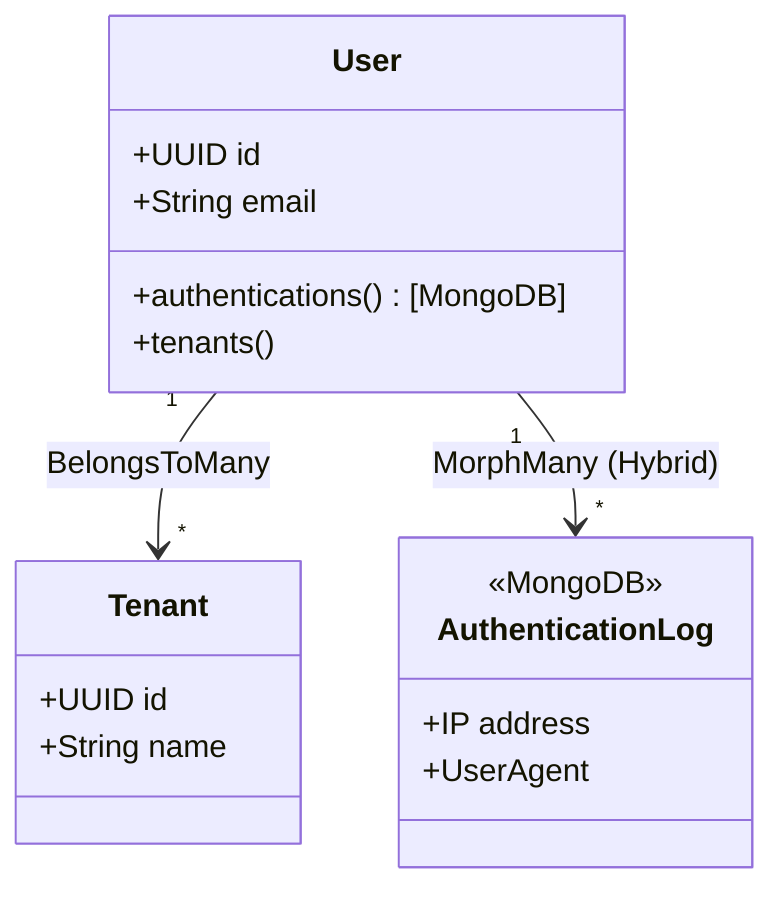

# Arquitetura do Model User

Este documento detalha a arquitetura, responsabilidades e a lógica interna do model `App\Models\User`. Como entidade central da aplicação, o Usuário interage com autenticação, multi-tenancy, permissões e armazenamento híbrido de dados.

## 1. Visão Geral

O model `User` é um model Eloquent padrão armazenado no banco de dados relacional (**PostgreSQL**). Ele implementa interfaces essenciais para o funcionamento do **Filament** e do sistema de autenticação multi-fator da aplicação.

### Interfaces Principais

-   `FilamentUser`: Permite acesso aos painéis administrativos.
-   `HasTenants`: Habilita a lógica de multi-tenancy do Filament.
-   `HasMedia`: Integração com Spatie Media Library para avatares.
-   `HasAppAuthentication` / `HasAppAuthenticationRecovery`: Suporte a 2FA customizado.

## 2. Organização do Código

Para manter a classe legível e manutenível, o código foi organizado em seções lógicas separadas por comentários visuais:

1.  **Setup & Configuration**:
    -   `casts`: Definição de tipos (ex: senhas hash, campos criptografados).
    -   `registerMediaCollections`: Configuração do disco S3 para avatares.
2.  **Relationships**: Todos os relacionamentos Eloquent (SQL e MongoDB).
3.  **Scopes**: Filtros de consulta reutilizáveis (ex: `withRolesForTenant`).
4.  **Filament / Access Control**: Métodos para controlar quem pode entrar em qual painel (`admin`, `user`) e em qual `tenant`.
5.  **State Checks & Notifications**: Métodos de verificação de estado (`isSuspended`, `isApproved`).
6.  **Tenant & Role Logic**: Lógica de negócio complexa para gerenciar papéis dentro de um contexto de Tenant (times).

## 3. Arquitetura Híbrida (SQL + MongoDB)

Uma das características mais importantes deste model é sua capacidade de se relacionar com logs armazenados no **MongoDB**, mantendo seus dados principais no **PostgreSQL**.

### Trait `HybridRelations`

O model utiliza a trait `MongoDB\Laravel\Eloquent\HybridRelations`. Isso permite que o Eloquent entenda relacionamentos entre bancos de dados diferentes (SQL Parent -> MongoDB Child).

```php
use \MongoDB\Laravel\Eloquent\HybridRelations;
```

### Logs de Autenticação (Correção de Driver)

O pacote `rappasoft/laravel-authentication-log` foi customizado para gravar logs no MongoDB. Para isso, o relacionamento `authentications()` foi sobrescrito no `User.php`.

**Problema Original:** A trait padrão do pacote tentava instanciar o model de Log usando uma conexão SQL padrão, causando erro `prepare() on null` ao tentar salvar no Mongo.

**Solução:** Sobrescrevemos o método para apontar explicitamente para `App\Models\AuthenticationLog` (que estende o Model do Mongo), garantindo que o driver correto seja carregado.

```php
public function authentications()
{
    // Força o uso do Model MongoDB customizado
    return $this->morphMany(\App\Models\AuthenticationLog::class, 'authenticatable')->latest('login_at');
}
```

## 4. Multi-Tenancy e Permissões

O sistema utiliza uma abordagem de **Multi-Tenancy com Times** (Tenants) onde os papéis (Roles) são atribuídos ao usuário _dentro do contexto de um Tenant_.

### Estrutura de Dados

-   **Users**: Tabela global.
-   **Tenants**: Tabela global.
-   **Roles**: Spatie Permissions (globais, mas atribuídas com `team_id`).
-   **Pivot (`model_has_roles`)**: Contém a coluna extra `team_id`.

### Métodos de Helper

A seção **Tenant & Role Logic** fornece métodos para abstrair a complexidade dessa query:

-   `isOwnerOfTenant($tenant)`: Verifica se o usuário tem o papel de 'Owner' no contexto daquele tenant.
-   `isUserOfTenant($tenant)`: Verifica se o usuário tem o papel de 'User' no contexto daquele tenant.
-   `getRolesForTenant($tenant)`: Retorna todos os papéis que o usuário possui naquele tenant específico.

Toda a lógica cruza `user_id` + `role_id` + `team_id` (Tenant).

## 5. Integração com Filament

O método `canAccessPanel(Panel $panel)` centraliza a lógica de autorização:

-   **Painel Admin**: Requer Role `Super Admin` (RoleType::ADMIN).
-   **Painel User**: Requer Role `User` OU ser dono de algum Tenant OU pertencer a algum Tenant.
-   **Bloqueios Globais**: Usuários suspensos ou sem e-mail verificado são bloqueados em todos os painéis (exceto 'auth').

## Diagrama de Relacionamento Simplificado


