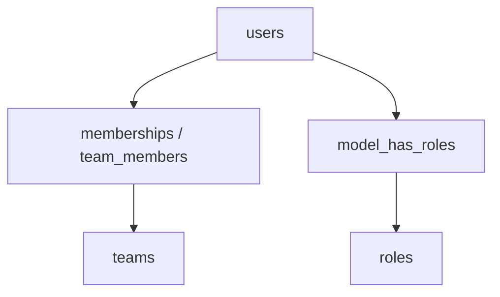
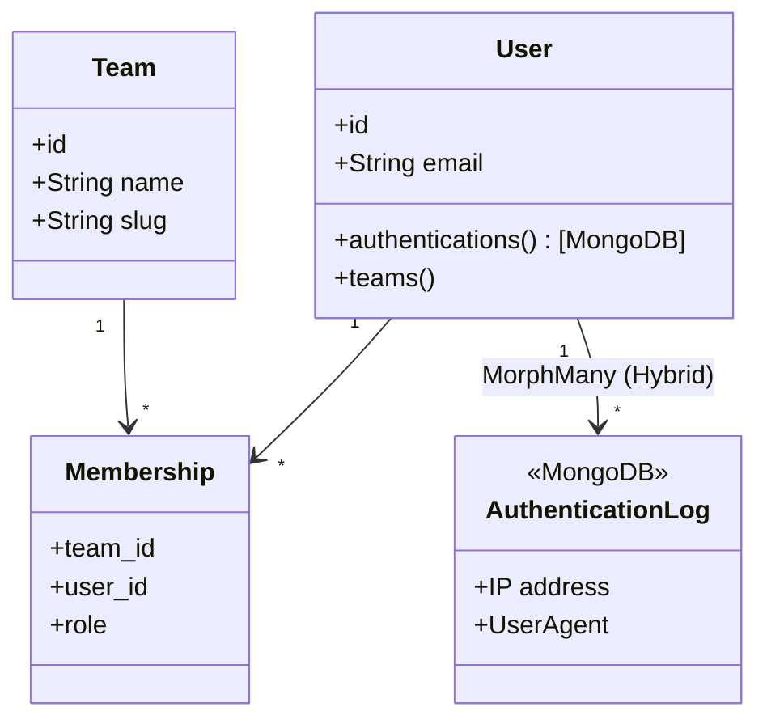

# Arquitetura do Model User

Este documento detalha a arquitetura, responsabilidades e a lógica interna do model `App\Models\User`. Como entidade central da aplicação, o Usuário interage com autenticação, multi-tenancy, permissões e armazenamento híbrido de dados.

## 1. Visão Geral

O model `User` é um model Eloquent padrão armazenado no banco de dados relacional (**PostgreSQL**). Ele implementa interfaces essenciais para o funcionamento do **Filament** e do sistema de autenticação multi-fator da aplicação.

### Interfaces Principais

-   `FilamentUser`: Permite acesso aos painéis administrativos.
-   `HasTenants`: Habilita a lógica de multi-tenancy do Filament.
-   `HasMedia`: Integração com Spatie Media Library para avatares.
-   `HasAppAuthentication` / `HasAppAuthenticationRecovery`: Suporte a 2FA customizado.

## 2. Organização do Código

Para manter a classe legível e manutenível, o código foi organizado em seções lógicas separadas por comentários visuais:

1.  **Setup & Configuration**:
    -   `casts`: Definição de tipos (ex: senhas hash, campos criptografados).
    -   `registerMediaConversions`: Configuração de otimizações de imagem e thumbnails (vazio por padrão neste model).
    -   (Nota: A configuração do disco S3 para avatares é feita diretamente no componente de upload do Filament, não no model via `registerMediaCollections`).
2.  **Relationships**: Todos os relacionamentos Eloquent (SQL e MongoDB).
3.  **Scopes**: Filtros de consulta reutilizáveis.
4.  **Filament / Access Control**: Métodos para controlar quem pode entrar em qual painel (`admin`, `user`) e em qual team (tenant Filament).
5.  **State Checks & Notifications**: Métodos de verificação de estado (`isSuspended`, `isApproved`).
6.  **Team & Role Logic**: Lógica de negócio para papéis dentro do contexto de um team.

## 3. Arquitetura Híbrida (SQL + MongoDB)

Uma das características mais importantes deste model é sua capacidade de se relacionar com logs armazenados no **MongoDB**, mantendo seus dados principais no **PostgreSQL**.

### Trait `HybridRelations`

O model utiliza a trait `MongoDB\Laravel\Eloquent\HybridRelations`. Isso permite que o Eloquent entenda relacionamentos entre bancos de dados diferentes (SQL Parent -> MongoDB Child).

```php
use \MongoDB\Laravel\Eloquent\HybridRelations;
```

### Logs de Autenticação (MongoDB)

O projeto utiliza `App\Models\AuthenticationLog` persistido em **MongoDB**. O relacionamento `authentications()` no `User` aponta explicitamente para esse model híbrido:

```php
public function authentications()
{
    return $this->morphMany(\App\Models\AuthenticationLog::class, 'authenticatable')->latest('login_at');
}
```

Eventos `Login`, `Logout` e `Failed` são registrados via `LogAuthenticationActivity` em `AppServiceProvider`.

## 4. Multi-Tenancy e Permissões

O sistema utiliza **multi-teams** (FilaTeams + Filament tenant API) onde os papéis Spatie são atribuídos ao usuário _dentro do contexto de um team_ (`team_id`).

### Estrutura de Dados

-   **Users**: Tabela global.
-   **Teams**: Tabela global (`teams`).
-   **Memberships**: Pivot FilaTeams (`team_id`, `user_id`, `role`).
-   **Roles**: Spatie Permissions (globais, atribuídas com `team_id`).
-   **Pivot (`model_has_roles`)**: Contém a coluna extra `team_id`.

### Métodos de Helper

A seção **Team & Role Logic** abstrai a complexidade das queries:

-   `isOwnerOfTeam(Team $team)`: Owner no contexto do team.
-   `isUserOfTeam(Team $team)`: User no contexto do team.
-   `getRolesForTeam(Team $team)`: Roles Spatie naquele team.
-   `assignRoleInTeam(Role $role, Team $team)`: Atribui role com `team_id` correto.

Toda a lógica cruza `user_id` + `role_id` + `team_id`.

### Distribuição Natural de Carga (Load Distribution)

Uma característica **arquitetural importante** desta estrutura é que ela promove **distribuição natural de carga** sem necessidade de particionamento da tabela `users`. Isso ocorre porque:

#### 1. Separação de Responsabilidades em Tabelas Pivot

Ao invés de armazenar todas as permissões diretamente na tabela `users`, o sistema utiliza **tabelas pivot normalizadas**:


```mermaid
graph TD
    A[users] --> B[memberships / team_members]
    A --> C[model_has_roles]
    B --> D[teams]
    C --> E[roles]
```

**Benefícios de Performance:**

- **Índices Menores**: Cada pivot tem índices específicos (`user_id`, `tenant_id`, `role_id`, `team_id`), que são muito mais compactos que um índice composto gigante na tabela `users`.
- **Queries Mais Eficientes**: PostgreSQL consegue otimizar JOINs em tabelas menores com maior eficiência do que escanear uma tabela monolítica com milhões de linhas.
- **Cache Hit Rate Maior**: Tabelas pivot frequentemente acessadas (ex: verificação de permissões) cabem inteiramente na memória (Shared Buffers do PostgreSQL), acelerando leituras.

#### 2. Exemplo Prático: Query de Autorização

Quando o Filament verifica teams acessíveis ao usuário, a consulta envolve `teams` + pivot de membership (FilaTeams), filtrando por `is_active`:

```sql
SELECT teams.*
FROM teams
INNER JOIN team_members ON team_members.team_id = teams.id
WHERE team_members.user_id = :user_id
  AND teams.is_active = true;
```

**Por que isso é eficiente?**

- Índices em `(user_id, team_id)` na pivot aceleram lookups por usuário.
- PostgreSQL usa **Index-Only Scan** quando possível em pivots menores.

#### 3. Comparação: Monolítico vs. Multi-Tenant Pivot

| Abordagem | Estrutura | Performance em 1M usuários |
|:----------|:----------|:---------------------------|
| **Monolítica** | `users` com JSON de `tenant_ids` e `permissions` | ❌ Índices GIN/JSONB são lentos para queries complexas. Tabela única de 1M+ linhas. |
| **Multi-Team Pivot** (labSIS-KIT) | `users` + memberships + `model_has_roles` | ✅ Tabelas especializadas; índices menores e JOINs otimizados. |
| **Particionamento** | `users` particionada por `created_at` ou `hash(id)` | ⚠️ Não resolve o problema de RBAC. Complexidade alta sem ganho real para este caso de uso. |

#### 4. Quando a Distribuição Atual NÃO é Suficiente?

A arquitetura pivot atinge seus limites quando:

- **Dezenas de milhões de usuários**: A tabela `model_has_roles` pode crescer desproporcionalmente (ex: 100M+ registros se cada usuário tem múltiplos papéis em múltiplos tenants).
- **Queries analíticas pesadas**: Relatórios que precisam agregar dados de todos os tenants simultaneamente podem ser lentos.

**Solução nesses casos:**
- **Particionamento da pivot `model_has_roles`** por `team_id` (Range ou Hash).
- **Read Replicas** para queries analíticas (separar carga de leitura e escrita).
- **Caching de Permissões** com Redis (evitar consultas repetidas ao banco).


## 5. Integração com Filament

O método `canAccessPanel(Panel $panel)` centraliza a lógica de autorização:

-   **Painel Admin**: Requer role `Admin` (`RoleType::ADMIN`).
-   **Painel User**: Requer role `User` ou `Owner` em algum team, ou membership ativo em `teams()`.
-   **Bloqueios Globais**: Usuários suspensos ou não aprovados são bloqueados nos painéis operacionais (exceto fluxos do painel `auth`).

## Diagrama de Relacionamento Simplificado


```mermaid
classDiagram
    class User {
        +id
        +String email
        +authentications() [MongoDB]
        +teams()
    }
    class Team {
        +id
        +String name
        +String slug
    }
    class Membership {
        +team_id
        +user_id
        +role
    }
    class AuthenticationLog {
        <<MongoDB>>
        +IP address
        +UserAgent
    }

    User "1" --> "*" Membership
    Team "1" --> "*" Membership
    User "1" --> "*" AuthenticationLog : MorphMany (Hybrid)
```

## Referências

- [Model: User](../../app/Models/User.php)
- [Model: Team](../../app/Models/Team.php)
- [Tenancy e Teams](../02-autenticacao-e-seguranca/tenancy-e-teams.md)

