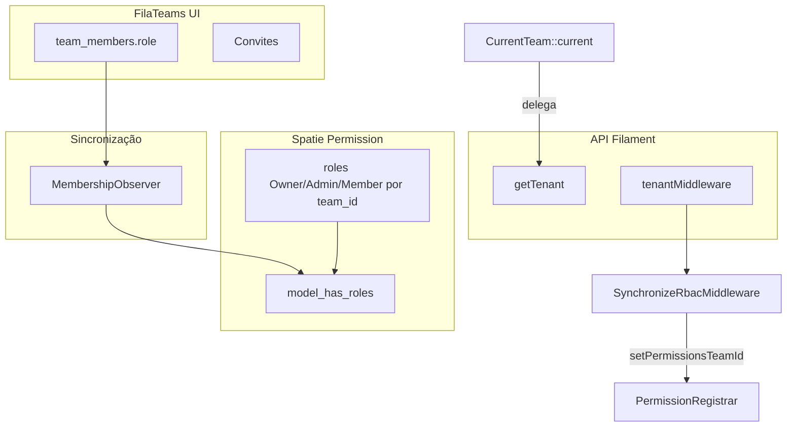

# Plano (otimizado): FilaTeams + Team como domínio + Spatie RBAC + `migrate:fresh`

**Estado:** não iniciado — documento de referência para implementação futura.

**Pacote:** [laraveldaily/filateams](https://github.com/LaravelDaily/FilaTeams) (Filament 5).

**Skills ativadas na elaboração:** `.cursor/skills/grill-me/SKILL.md` (decisões de produto/arquitetura) + exploração da base de código (estado atual `Tenant`/`tenant_user`/Spatie).

**Skill recomendada na execução:** `.cursor/skills/laravel-best-practices/SKILL.md` + `.cursor/skills/laravel-permission-development/SKILL.md` + `search-docs` (Filament tenancy + Spatie teams).

---

## Decisões fechadas no grill-me (fonte de verdade)

| Decisão | Escolha |
|--------|---------|
| **Papel do FilaTeams** | Scaffolding de UI: switcher, settings, convites, pivot `team_members` — **sem** duplicar “modelo mental” de RBAC fora do Spatie para autorização de negócio. |
| **Fonte única da role por equipe** | Coluna `team_members.role` (enum/string do pacote) é **canônica**. Spatie deriva **automaticamente** (Observer) para exatamente **3 roles Spatie por `Team`**: `Owner`, `Admin`, `Member` (nomes alinhados aos enums padrão do pacote). |
| **Cluster `UserRole`** | **Remover** — a gestão de papéis por membro passa a ser a UI do FilaTeams em `/{panel}/{team}/settings`. |
| **Cluster `Permissions`** | **Manter** — continua sendo o lugar onde o **Admin** edita *quais permissões Spatie* cada uma das 3 roles tem **dentro do contexto de equipe** (`team_id` = PK de `Team`). |
| **Super-admin do sistema** | Coluna `users.is_admin` (boolean) + `Gate`/policy dedicada para o painel `/admin`. **Não** usar role Spatie global em `team_id = 0` para “Admin do sistema”. |
| **Entrada de usuários** | **Sem registro público** — fluxo apenas por **convite** (email do FilaTeams) + criação/gestão de usuários pelo Admin quando necessário. |
| **Quem cria `Team`** | Apenas **Admin** (`is_admin`) via **Filament Resource** no painel `/admin`. **Desabilitar** a rota/página “Create Team” do painel `/user` (`/user/new` ou equivalente exposto pelo plugin). |
| **Migrations** | **Reescrever migrations legadas in-place** + remover incremental redundante — baseline único coerente com `migrate:fresh` (sem “tapete” de migrations corretivas). |
| **Defaults quando pergunta foi pulada** | **Slug na URL:** usar `teams.slug` (padrão do pacote). **`is_approved`:** candidato a remoção (sem registro público); **`is_suspended`:** manter para moderação — validar com stakeholders antes de dropar colunas. |

---

## Checklist de fases

- [ ] **Fase 0** — Branch; backup BD local; acordo explícito `migrate:fresh` (dev/staging)
- [ ] **Fase 1** — `composer require laraveldaily/filateams`; publish config; `search-docs` tenancy Filament
- [ ] **Fase 2** — Rebaseline migrations: remover `tenants`/`tenant_user`; `media_items`/`videos` com `team_id` → `teams`; Spatie teams desde `create_permission_tables`; `users.is_admin`; merge `enable_permission_teams`
- [ ] **Fase 3** — `User`: `HasTenants` (Filament) + `HasTeamMembership` + `HasTeams` (pacote) + `HasRoles` (Spatie); remover stack `Tenant`
- [ ] **Fase 4** — `CurrentTeam` helper; `SpatieTeamResolver` + middleware renomeado alinhados ao helper
- [ ] **Fase 5** — `UserPanelProvider`: `FilaTeamsPlugin` + `->tenant(Team::class, slugAttribute: 'slug', …)` + middleware RBAC
- [ ] **Fase 6** — Observer `Membership` → sync Spatie; garantir 3 roles Spatie por team na criação do team
- [ ] **Fase 7** — Remover cluster `UserRole`; adaptar cluster `Permissions` para `Team` e fluxo Admin-only
- [ ] **Fase 8** — Painel `/admin`: Resource `TeamResource` (criação + Owner inicial); bloquear criação pelo `/user`
- [ ] **Fase 9** — Auth: desabilitar registro público + remover/alinhar `Register.php` legado
- [ ] **Fase 10** — Policies/resources/widgets: trocar `Tenant`→`Team`, `tenant_id`→`team_id`, `Filament::getTenant()`→`CurrentTeam::current()` onde aplicável
- [ ] **Fase 11** — Docs (`docs/02-autenticacao-e-seguranca/tenancy-e-teams.md`, `AGENTS.md`), Pest (`PanelAccessTest` com slug), Pint

---

## 1. Visão geral

### Contexto atual (base de código — Maio/2026)

- Organização = modelo **`Tenant`** + pivot **`tenant_user`**.
- Filament painel `user`: `->tenant(Tenant::class, slugAttribute: 'uuid', ownershipRelationship: 'tenants')`.
- Spatie Permission com **teams**: `team_id` nas pivots = **`tenants.id`** (não existe modelo `Team`).
- Middleware `TeamSyncMiddleware` + `SpatieTeamResolver` sincronizam `PermissionRegistrar::setPermissionsTeamId` com o tenant da rota / `Filament::getTenant()`.
- UI custom: clusters **`Permissions`** e **`UserRole`** (`ManageUserRoles` usa query string `tenant_id`).
- Registro público (`Register.php`) cria `Tenant` + `tenant_name` + usuário suspenso até aprovação.

### Objetivo

- **Domínio da app:** apenas **`Team`** (tabelas/migrations/model `Team` do pacote ou extendido). **Sem** `Tenant`, **sem** `tenant_id`, **sem** vocabulário “tenant” no código de negócio — exceto nomes fixos da API Filament (`HasTenants`, `getTenant()`, `tenantMiddleware`, etc.; ver §2).
- **RBAC:** Spatie continua sendo a **autoridade** para permissões de negócio; **papéis por equipe** refletem **sempre** o valor canônico em `team_members.role` via sincronização automática.
- **Onboarding:** fluxo **somente convite** + criação administrativa de equipes no `/admin`.
- **Bootstrap de BD:** `migrate:fresh --seed` no ambiente acordado.

### Por que este plano difere do “README ideal” do pacote

O README do FilaTeams assume projeto **quase vazio** e **registro com personal team automático**. Este projeto exige: **Spatie como autoridade**, **sem registro público**, **criação de equipes só por Admin**, e **edição fina de permissões** via cluster existente — logo, haverá **customização** além do `->plugin(FilaTeamsPlugin::make())` “zero config”.

---

## 2. Filament: API com nome “tenant” vs domínio “Team”

| Camada | Regra |
|--------|--------|
| **Negócio (`app/`, policies, resources)** | Somente `Team`, `$team`, `team_id`. Contexto via `CurrentTeam::current()` (encapsula `Filament::getTenant()` → `?Team`). **Proibido** `$tenant` para organização. |
| **`HasTenants` / `getTenants()`** | Contratos Filament — implementar retornando coleção de `Team` acessíveis. PHPDoc: *“Implementação Filament HasTenants — equipes (`Team`).”* |
| **`Panel::tenant(...)` / `tenantMiddleware`** | Nomes fixos do Filament — configurar com `Team::class`. |
| **URLs** | Padrão assumido: **`slug`** (`/user/{slug}/...`). |

**Frase sugerida para `AGENTS.md`:** *Na app, organização = `Team`. `Filament::getTenant()` só na camada de compatibilidade; preferir `CurrentTeam::current()`.*

---

## 3. Arquitetura

### 3.1 Modelagem RBAC (fonte única + Spatie)

```text
team_members.role (canônico, UI FilaTeams)
        │
        ▼ Observer / sync
model_has_roles + roles (Spatie, team_id = teams.id)
        │
        ▼
Policies / `$user->can()` / `hasPermissionTo()` no contexto de equipe
```

- **Três roles Spatie por equipe** (criadas lazy na primeira membership ou na criação do `Team`): `Owner`, `Admin`, `Member` — nomes devem bater com `TeamRole` publicado/configurado no `config/filateams.php` para evitar drift.
- **Permissões Spatie** continuam sendo as permissões de **negócio** (strings já existentes no projeto). O cluster `Permissions` altera `role_has_permissions` **por role-id + team_id** (ou estratégia equivalente já usada hoje, adaptada de `Tenant` → `Team`).

### 3.2 Super-admin

- `users.is_admin = true` → acesso ao painel `/admin` e ao `TeamResource`.
- **Não** delegar “é admin do sistema?” ao Spatie.

### 3.3 Arquivos e áreas principais

| Área | Caminho (atual → alvo) |
|------|-------------------------|
| Helper | **Novo** `app/Filament/Support/CurrentTeam.php` (ou `app/Tenancy/CurrentTeam.php`) |
| Panel user | `app/Providers/Filament/UserPanelProvider.php` |
| User | `app/Models/User.php` |
| Middleware | `app/Http/Middleware/TeamSyncMiddleware.php` → `SynchronizeRbacMiddleware.php` |
| Resolver | `app/Tenancy/SpatieTeamResolver.php` |
| Role extendida | `app/Models/Role.php` — `belongsTo(Team::class, 'team_id')` |
| Remover | `app/Models/Tenant.php`, `app/Models/TenantUser.php`, `app/Filament/Resources/Tenants/**` |
| Remover | `app/Filament/Clusters/UserRole/**` |
| Adaptar | `app/Filament/Clusters/Permissions/**` |
| Auth | `app/Providers/Filament/AuthPanelProvider.php` — desativar `registration()` / remover página |
| Registro legado | `app/Filament/Pages/Auth/Register.php` — remover ou reduzir a no-op |
| Domínio com FK | `app/Models/MediaItem.php`, `Video`, migrations — `tenant_id` → `team_id` |
| Observer | **Novo** `app/Observers/TeamMembershipObserver.php` (ou listener em `Membership` saved) |
| Admin | **Novo** `app/Filament/Resources/Teams/*` (CRUD mínimo + definir Owner inicial) |
| Docs | `docs/02-autenticacao-e-seguranca/tenancy-e-teams.md`, `AGENTS.md` |
| Testes | `tests/Feature/PanelAccessTest.php` — slug do `Team` |

---

## 4. Roteiro de execução (Entrada → Saída → Verificação)

### Fase 0 — Preparação

- **Entrada:** branch limpa; política de dados.
- **Saída:** Acordo por escrito: `migrate:fresh` **apaga** todos os dados locais; produção **fora de escopo** sem backup + runbook.
- **Verificação:** checklist assinado/time informado.

### Fase 1 — Pacote

- **Entrada:** `composer.json`.
- **Saída:** `laraveldaily/filateams` instalado via Sail; `php artisan vendor:publish --tag=filateams-config`; README do pacote lido; `search-docs` para tenancy Filament v5.
- **Verificação:** `composer show laraveldaily/filateams`; arquivo `config/filateams.php` presente.

### Fase 2 — Migrations (rebaseline)

- **Entrada:** `database/migrations/2025_09_17_000100_*`, `000110_*`, `000120_*`, `2025_08_26_200400_*`, `2025_09_17_000130_*`, migrations do pacote FilaTeams (após install).
- **Saída:**
  - Sem tabelas `tenants` / `tenant_user`.
  - Tabelas do pacote: `teams`, `team_members`, `team_invitations`, coluna `users.current_team_id` (conforme README).
  - `media_items`, `videos`: FK **`team_id` → `teams.id`** (substitui `tenant_id`).
  - `permission` tables já nascem com `teams` habilitado — **mesclar** o que hoje está em `enable_permission_teams` dentro da migration base ou remover arquivo incremental redundante.
  - Migration nova: `users.is_admin` (default `false`).
  - **Ordem:** garantir `teams` antes de FKs `team_id`.
- **Verificação:** `vendor/bin/sail artisan migrate:fresh` sem erro; `vendor/bin/sail artisan db:show` / inspeção schema.

### Fase 3 — `User` e remoção do `Tenant`

- **Entrada:** `app/Models/User.php`.
- **Saída:**
  - `implements HasTeamMembership` + `HasTenants` + contratos Filament existentes.
  - `use HasTeams` (pacote) + `HasRoles` (Spatie).
  - `tenants()` / `canAccessTenant` / `getTenants` reescritos para **`Team`** (ou removidos substituídos pelos métodos do trait `HasTeams` + adapter explícito para `HasTenants`).
  - Métodos `*Tenant*` renomeados para `*Team*` ou removidos se duplicarem o pacote.
- **Verificação:** `php artisan test --compact --filter=User` (criar/ajustar testes mínimos); compilação PHP.

### Fase 4 — `CurrentTeam`, resolver, middleware

- **Entrada:** `SpatieTeamResolver`, `TeamSyncMiddleware`.
- **Saída:**
  - `CurrentTeam::current(): ?Team`.
  - Resolver usa helper (e mantém override estático se ainda necessário para testes).
  - Middleware renomeado para `SynchronizeRbacMiddleware` — mesma responsabilidade: validar acesso à equipe da rota + `setPermissionsTeamId`.
- **Verificação:** `rg 'Filament::getTenant\\(' app/` tende a zero fora do helper/resolver/middleware (lista de exceções documentada).

### Fase 5 — `UserPanelProvider`

- **Entrada:** `UserPanelProvider.php`.
- **Saída:**
  - `->plugin(FilaTeamsPlugin::make())` (ou factory equivalente da versão instalada).
  - `->tenant(Team::class, slugAttribute: 'slug', ownershipRelationship: /* relationship exposta pelo HasTeams */)`.
  - `tenantMiddleware([SynchronizeRbacMiddleware::class], isPersistent: true)`.
  - Labels UI “Equipe”, não “Tenant”.
- **Verificação:** login smoke no painel `user`; troca de equipe; permissões corretas ao trocar slug na URL.

### Fase 6 — Observer de membership + roles por team

- **Entrada:** model `Membership` do pacote (via config `filateams.models.membership`).
- **Saída:**
  - Ao criar/atualizar/remover `team_members`, sincronizar **uma** role Spatie ativa para aquele usuário naquele `team_id` coerente com `team_members.role`.
  - Garantir existência das 3 roles Spatie por equipe antes do attach.
- **Verificação:** teste Pest que altera role na pivot e assert `hasRole`/`hasPermissionTo` no contexto do team.

### Fase 7 — Clusters Filament

- **Entrada:** `Permissions/**`, `UserRole/**`.
- **Saída:** `UserRole` removido do discovery ou pasta apagada; `Permissions` usa `Team` e não lista todas as equipes para usuários não-admin.
- **Verificação:** navegação Filament sem rotas mortas; coverage mínima em Pest para página base.

### Fase 8 — Painel Admin (`TeamResource`)

- **Entrada:** `AdminPanelProvider.php`.
- **Saída:**
  - CRUD (ou Create/Edit mínimos) de `Team`.
  - Campo para definir **Owner inicial** (usuário existente) na criação — cria `team_members` + dispara observer.
  - Policy: só `is_admin`.
  - Bloquear criação alternativa no `/user` (hook no plugin, unregister route, ou policy global — escolher na implementação consultando código-fonte do plugin).
- **Verificação:** usuário não-admin **não** acessa `/admin` nem cria team; admin cria team e owner consegue convidar.

### Fase 9 — Auth / Registro

- **Entrada:** `AuthPanelProvider.php`, `Register.php`.
- **Saída:** registro público desligado; convites habilitados conforme pacote; páginas legadas de “cadastro” removidas ou redirecionam.
- **Verificação:** rota de register retorna 404 ou redirect; fluxo de invite aceito coberto por teste feature.

### Fase 10 — Domínio diverso (policies, resources, media)

- **Entrada:** grep de `Tenant`, `tenant_id`, `$tenant`.
- **Saída:** atualização completa para `Team`/`team_id`; generators de path de media usando `CurrentTeam`.
- **Verificação:** `rg '\\bTenant\\b' app/` só em comentários arquivados ou imports impossíveis = zero.

### Fase 11 — Docs, seeds, testes, Pint

- **Entrada:** `UserSeeder.php`, factories, docs.
- **Saída:**
  - Seeder cria admin com `is_admin=true` (sem role global Spatie).
  - Seeds usam `Team` + memberships + observer (ou helpers explícitos).
  - Documentação alinhada ao novo modelo.
- **Verificação:** `vendor/bin/sail artisan migrate:fresh --seed`; `vendor/bin/sail artisan test --compact`; `vendor/bin/sail bin pint --dirty`.

---

## 5. Diagrama



---

## 6. Riscos e mitigações

| Risco | Mitigação |
|-------|-----------|
| **Compatibilidade `HasTeams` + `HasTenants`** | Leia o código do trait na versão instalada; escreva testes de integração para `getTenants()` / `canAccessTenant(Model $tenant)` (renomear mentalmente para Team). |
| **Duplo papel durante transição** | Observer idempotente + testes de atualização de membership. |
| **Cluster Permissions incompatibility** | QA manual + testes Livewire em alteração de permissões por role. |
| **Convites vs usuários suspensos** | Definir se conta criada por convite nasce ativa; `is_suspended` continua útil para ban. |
| **Pacote assume `/admin` nos exemplos** | Este projeto usa painel `user` em `/user` — validar paths reais após instalar plugin (`route:list`). |

---

## 7. O que não fazer

- Não manter **`tenants`** e **`teams`** em paralelo.
- Não rodar **`migrate:fresh`** em produção sem backup explícito.
- Não introduzir **`Tenant`** de volta ao domínio.
- Não usar **`$tenant`** para **`Team`** no código aplicacional.
- Não depender de **`getTeam()`** inexistente — usar **`CurrentTeam`**.
- Não assumir que o pacote sozinho substitui **Spatie** — o plano exige **camada de sincronização**.

---

## 8. Pendências para validação humana (após merge do plano)

- Confirmar remoção de **`is_approved`** / campos associados (`approved_by`, etc.) vs manter por compatibilidade de dados históricos em outros ambientes.
- Confirmar se **`Video`** / outros modelos precisam de relação `team()` explícita além da FK.
